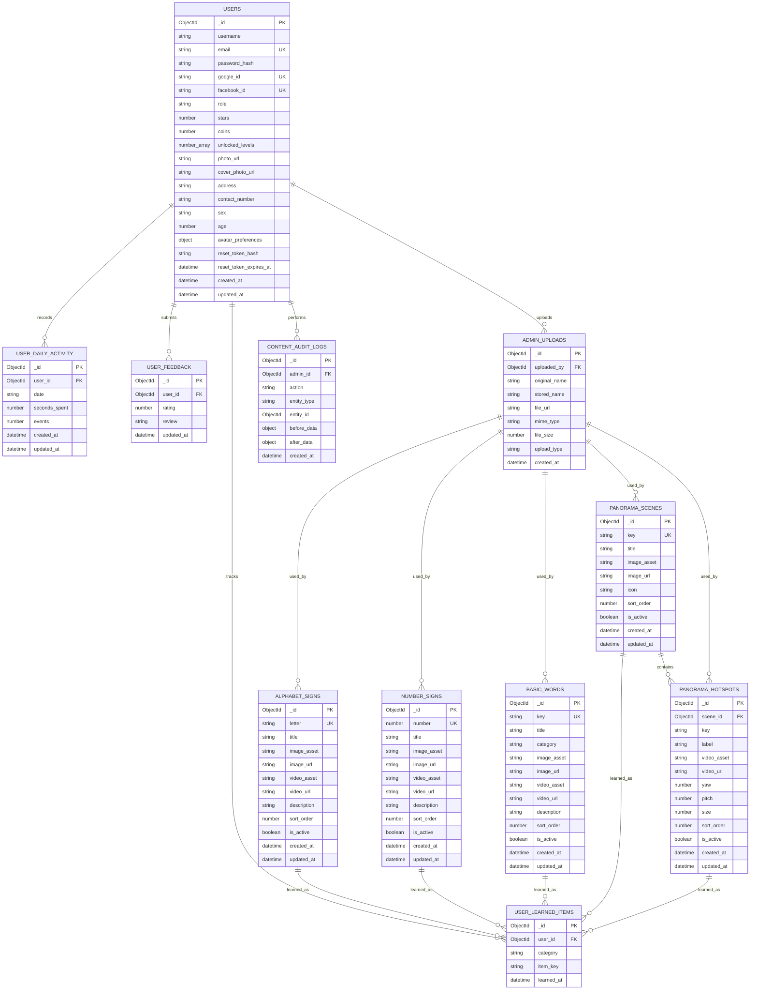

# TalkWithHands Data Model

This data model supports both regular users and admin users. Regular users learn signs, play games, use Sign to Text, customize profiles, and track progress. Admin users manage learning content, uploaded media, and analytics.

## Entity Relationship Diagram

## Collection Details

### USERS
Stores both learners and admins. The `role` field separates regular accounts from admin accounts.

| Field | Type | Description |
| --- | --- | --- |
| `_id` | ObjectId | Primary key |
| `username` | String | Display name |
| `email` | String | Login email; unique when present |
| `password_hash` | String | Encrypted local password |
| `google_id` | String | Google login identifier |
| `facebook_id` | String | Facebook login identifier |
| `role` | Enum | `user` or `admin` |
| `stars` | Number | Game reward count |
| `coins` | Number | Game currency |
| `unlocked_levels` | Number[] | Levels available to the user |
| `photo_url` | String | Profile photo |
| `cover_photo_url` | String | Profile cover image |
| `address` | String | User address |
| `contact_number` | String | Contact number |
| `sex` | Enum | `Female`, `Male`, `Prefer not to say`, or blank |
| `age` | Number | User age |
| `avatar_preferences` | Object | Chibi avatar character, skin tone, and outfit |
| `reset_token_hash` | String | Password reset token hash |
| `reset_token_expires_at` | DateTime | Password reset expiry |
| `created_at`, `updated_at` | DateTime | Audit timestamps |

### USER_LEARNED_ITEMS
Tracks every lesson item a user has learned.

| Field | Type | Description |
| --- | --- | --- |
| `_id` | ObjectId | Primary key |
| `user_id` | ObjectId | References `USERS._id` |
| `category` | Enum | `alphabet`, `number`, `basic_word`, `panorama`, `detector` |
| `item_key` | String | Learned item identifier, such as `A`, `1`, or `hello` |
| `learned_at` | DateTime | Date learned |

### USER_DAILY_ACTIVITY
Stores user activity per day for progress charts and streaks.

| Field | Type | Description |
| --- | --- | --- |
| `_id` | ObjectId | Primary key |
| `user_id` | ObjectId | References `USERS._id` |
| `date` | String | Activity date, usually `YYYY-MM-DD` |
| `seconds_spent` | Number | Time spent in the app |
| `events` | Number | Number of learning/game actions |
| `created_at`, `updated_at` | DateTime | Audit timestamps |

### USER_FEEDBACK
Stores app ratings and reviews from users.

| Field | Type | Description |
| --- | --- | --- |
| `_id` | ObjectId | Primary key |
| `user_id` | ObjectId | References `USERS._id` |
| `rating` | Number | Rating from 0 to 5 |
| `review` | String | User feedback text |
| `updated_at` | DateTime | Last feedback update |

### ALPHABET_SIGNS
Stores A-Z sign language lessons.

| Field | Type | Description |
| --- | --- | --- |
| `_id` | ObjectId | Primary key |
| `letter` | String | Unique alphabet letter |
| `title` | String | Display title |
| `image_asset`, `image_url` | String | Local or uploaded image |
| `video_asset`, `video_url` | String | Local or uploaded video |
| `description` | String | Lesson description |
| `sort_order` | Number | Display order |
| `is_active` | Boolean | Visibility status |
| `created_at`, `updated_at` | DateTime | Audit timestamps |

### NUMBER_SIGNS
Stores number sign lessons.

| Field | Type | Description |
| --- | --- | --- |
| `_id` | ObjectId | Primary key |
| `number` | Number | Unique number sign |
| `title` | String | Display title |
| `image_asset`, `image_url` | String | Local or uploaded image |
| `video_asset`, `video_url` | String | Local or uploaded video |
| `description` | String | Lesson description |
| `sort_order` | Number | Display order |
| `is_active` | Boolean | Visibility status |
| `created_at`, `updated_at` | DateTime | Audit timestamps |

### BASIC_WORDS
Stores basic word sign lessons.

| Field | Type | Description |
| --- | --- | --- |
| `_id` | ObjectId | Primary key |
| `key` | String | Unique word key, such as `hello` |
| `title` | String | Display title |
| `category` | String | Word category |
| `image_asset`, `image_url` | String | Local or uploaded image |
| `video_asset`, `video_url` | String | Local or uploaded video |
| `description` | String | Lesson description |
| `sort_order` | Number | Display order |
| `is_active` | Boolean | Visibility status |
| `created_at`, `updated_at` | DateTime | Audit timestamps |

### PANORAMA_SCENES
Stores 360-degree learning environments.

| Field | Type | Description |
| --- | --- | --- |
| `_id` | ObjectId | Primary key |
| `key` | String | Unique scene key |
| `title` | String | Scene title |
| `image_asset`, `image_url` | String | Panorama image |
| `icon` | String | Scene icon |
| `sort_order` | Number | Display order |
| `is_active` | Boolean | Visibility status |
| `created_at`, `updated_at` | DateTime | Audit timestamps |

### PANORAMA_HOTSPOTS
Stores clickable learning points inside panorama scenes.

| Field | Type | Description |
| --- | --- | --- |
| `_id` | ObjectId | Primary key |
| `scene_id` | ObjectId | References `PANORAMA_SCENES._id` |
| `key` | String | Hotspot key unique within a scene |
| `label` | String | Display label |
| `video_asset`, `video_url` | String | Lesson video |
| `yaw`, `pitch` | Number | Position in the 360 scene |
| `size` | Number | Marker size |
| `sort_order` | Number | Display order |
| `is_active` | Boolean | Visibility status |
| `created_at`, `updated_at` | DateTime | Audit timestamps |

### ADMIN_UPLOADS
Stores files uploaded by admins for lesson content.

| Field | Type | Description |
| --- | --- | --- |
| `_id` | ObjectId | Primary key |
| `uploaded_by` | ObjectId | References admin `USERS._id` |
| `original_name` | String | Original file name |
| `stored_name` | String | Stored server file name |
| `file_url` | String | Public URL |
| `mime_type` | String | File MIME type |
| `file_size` | Number | File size in bytes |
| `upload_type` | Enum | `image` or `video` |
| `created_at` | DateTime | Upload timestamp |

### CONTENT_AUDIT_LOGS
Tracks admin content changes for accountability.

| Field | Type | Description |
| --- | --- | --- |
| `_id` | ObjectId | Primary key |
| `admin_id` | ObjectId | References admin `USERS._id` |
| `action` | Enum | `create`, `update`, `delete`, `upload`, `activate`, `deactivate` |
| `entity_type` | String | Changed collection name |
| `entity_id` | ObjectId | Changed record ID |
| `before_data` | Object | Record state before change |
| `after_data` | Object | Record state after change |
| `created_at` | DateTime | Action timestamp |

## Main Relationships

| Relationship | Cardinality | Description |
| --- | --- | --- |
| `USERS` to `USER_LEARNED_ITEMS` | 1-to-many | One user can learn many items |
| `USERS` to `USER_DAILY_ACTIVITY` | 1-to-many | One user has many daily activity records |
| `USERS` to `USER_FEEDBACK` | 1-to-many | One user can submit or update feedback |
| `PANORAMA_SCENES` to `PANORAMA_HOTSPOTS` | 1-to-many | One scene contains many hotspots |
| `USERS(admin)` to `ADMIN_UPLOADS` | 1-to-many | One admin can upload many media files |
| `USERS(admin)` to `CONTENT_AUDIT_LOGS` | 1-to-many | One admin can perform many logged actions |
| Learning content to `USER_LEARNED_ITEMS` | 1-to-many | Content can be referenced as learned progress |

## Admin Capabilities

Admin users can:

- Manage alphabet signs.
- Manage number signs.
- Manage basic words.
- Manage panorama scenes and hotspots.
- Upload image and video content.
- View users and analytics.
- Review app feedback.
- Track content changes through audit logs.

## User Capabilities

Regular users can:

- Register and log in using email, Google, or Facebook.
- Update profile and avatar preferences.
- Learn alphabet signs, number signs, basic words, and panorama lessons.
- Use Sign to Text detection.
- Play learning games.
- Earn stars and coins.
- Track learning progress and daily activity.
- Submit app feedback.
