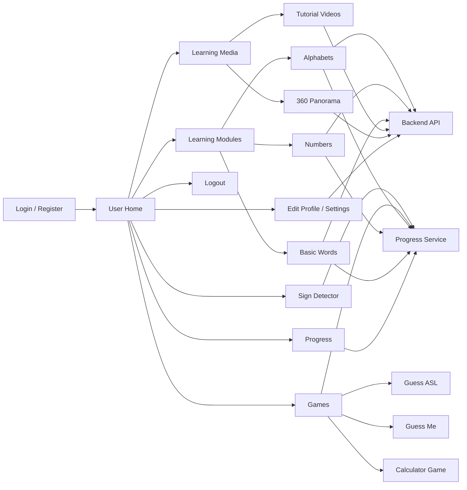
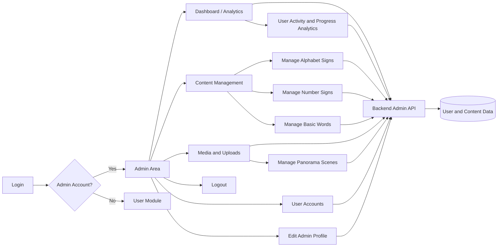

# User and Admin Block Diagrams

These diagrams describe the main application flows in Talk with Hands. They use Mermaid flowchart syntax and can be rendered by VS Code extensions, GitHub, or Mermaid Live.

## User Module

## Admin Module

## Main Backend Services

The Flutter and React Native clients communicate with the Node.js backend through these areas:

- Authentication and user profiles
- Alphabet signs
- Number signs
- Basic words
- Progress tracking
- Panorama scenes
- Media and video delivery
- Admin uploads
- Admin analytics